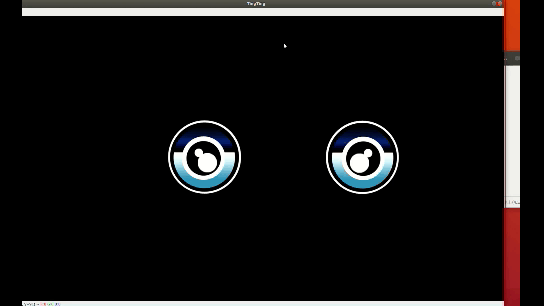
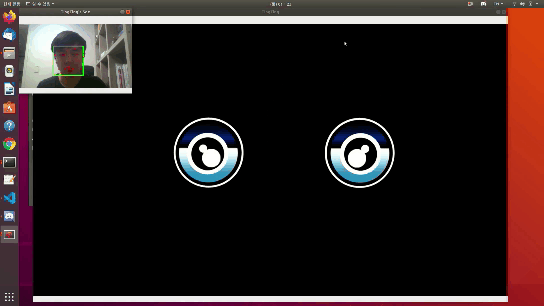
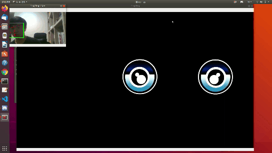
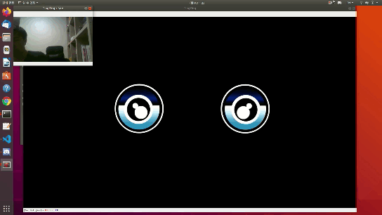

# TingTing

TingTing is my friends!

It just Simple Deep Learning and Machine Learning project!

TingTing can watch you and free talking!

Enjoy project

# Notice

First, I apologies that This project is not completed yet.

Therefore, the code has not been cleaned up.

Also, the environment has not been decided yet.

I promise upload it as soon as I finish it.

---

# Result

### Facial LandMark

### TingTing's Eye

# TingTing Result

You can see that the X axis of the eye is the opposite.

This is because of the difference between the webcam screen and the actual environment.

### Follow the eye

follow the webcam's eye

### Come back eye

If there is no eye in the screen, come back the center

### Re Follow the eye

When the eyes reappear, following them again does not perform well.

Because there was a frame that couldn't track the face in the dlib

# Reference

I wrote this code by referring to the sites below.

[pyimagesearch](https://www.pyimagesearch.com/)

[Video Online Converter](https://video.online-convert.com/)